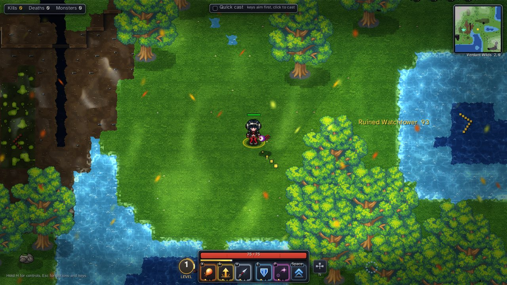
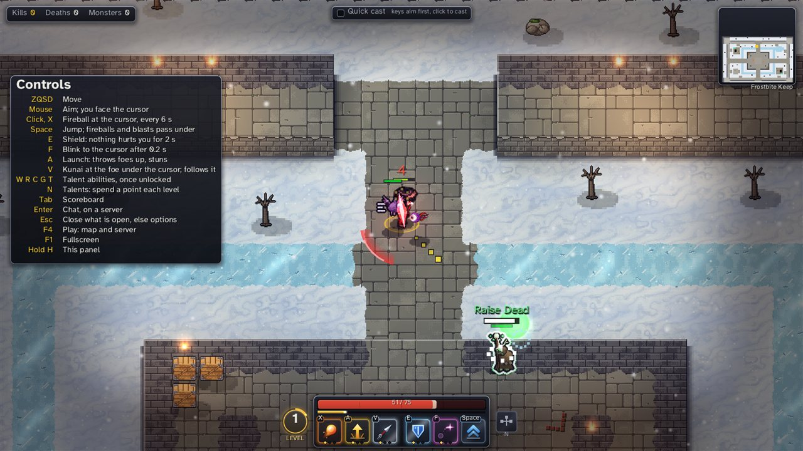
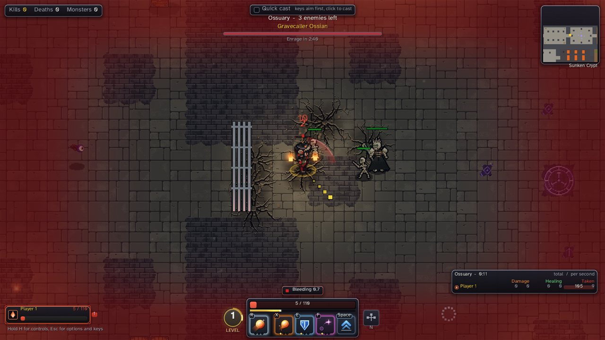
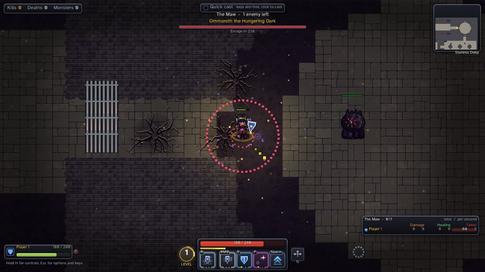

# Game-Demo

An online 2D action game written from scratch in C++ on the Win32 API and OpenGL. No engine, no standard library containers, and all of the game's memory is reserved once at startup. The same game code also builds for the browser (Emscripten) and as a headless Linux server.

There are two ways to play, and players switch between them with the Mode row of the vote in the Esc menu:

- **Duels.** Up to eight players fight each other on a rotating map (Old Arena, Frostbite Keep, and the endless Verdant Wilds and Ashen Wastes) while monsters roam it as hazards. Players level up from kills and from time in the match, and every level is a talent point.
- **Dungeon runs.** Up to eight players clear a dungeon together, room by room, through packs, elites and bosses. Each player picks one of ten classes in the lobby room (Bulwark, Mender, Fire Mage, Ranger, Berserker, Shadowblade, Frost Mage, Druid, Stormcaller, Duelist), which sets their role: tank, healer, ranged or melee damage. There are five levels, each harder than the last: Sunken Crypt, Ember Depths, Rimeheart Vault, Aurora Rift and Starless Deep.

To play, download `GameDemo.exe` from https://game.sindansolutions.com. It installs the game, keeps it up to date, and the game joins the live server on its own.






## Controls

The game lists every key in a panel on the left for the first 10 seconds, and again whenever you hold H. Keys below are as on an AZERTY keyboard. On QWERTY the letters move to the same places (ZQSD becomes WASD).

| Key | Duel | Dungeon run |
|---|---|---|
| Z, Q, S, D | Move | Move |
| Mouse | Aim; you face the cursor | Aim |
| Left click or X | Fireball at the cursor | Fireball, or the class's own spell on X |
| Right click | Sword, once unlocked | The class's basic attack, if it has one |
| Space | Jump; fireballs and blasts pass under | Jump |
| E | Shield: nothing hurts you for 2 s | Shield |
| F | Blink to the cursor | Blink |
| A | Launch: throws foes up and stuns them | Class spell |
| R | Talent ability | Class spell |
| C, V | Talent abilities (V starts as the kunai) | Class spells the talent tree unlocks |
| W, G, T | Talent abilities | W: class spell, for classes that have one |
| N | Talents | Talents |
| Tab (hold) | Scoreboard | Scoreboard |
| Enter | Chat, on a server | Chat |
| Esc | Close what is open, else the options menu | Same |
| F4 | Pick a map and a server | Same |
| F1, F11 or Alt+Enter | Fullscreen | Same |
| H (hold) | Controls panel | Controls panel |

The Esc menu has the rest:

- **Key bindings.** Put any action on another key, with separate sets for duels and dungeon runs. They are saved in `keys.txt`.
- **Control scheme.** Switch to mouse movement: a left click walks there, and the spells move onto the keys under the left hand.
- **Quick cast.** The checkbox at the top of the screen. When it is on, a spell key casts at once. When it is off, an area spell's key shows its range first and a left click casts it.

F3 opens the tile editor. In developer builds on Windows, F2 records input and a second press loops the recording.

## Building on Windows

You need Visual Studio 2019 or later with the C++ desktop tools. The scripts find it and set up the 64-bit compiler themselves, and they work from any folder. To build and play, run (or double-click):

```
run.bat
```

| Script | What it does |
|---|---|
| `run.bat` | Builds the game, then starts it from `build/`. `run.bat release` for an optimized build |
| `build.bat` | Builds the game into `build/`: `win32_app.exe`, `app.dll`, the launcher, and `asset_1.zas` (art and sound). `build.bat release` turns optimization on and asserts and developer keys off |
| `test.bat` | Builds and runs every test program in `code/tests/` (about 12 seconds). Fails if any test fails or crashes |
| `build_server.bat` | Builds the dedicated server `build\server.exe [port]` (default port 27015) and its tools: `probe.exe` (can a player join?), `bots.exe` (load test) and `replay.exe` |
| `art.bat` | Draws every monster sprite sheet and map into `build\monster_art\` as PNG, for review |
| `sounds.bat` | Writes every sound effect into `build\sounds\` as WAV |
| `misc\screenshot.bat out.png [frame]` | Runs the game offline, saves one frame as PNG and quits |

Start the game from inside `build/`, because it loads `asset_1.zas`, `shaders/` and `fonts/` from the current folder. `run.bat` does this for you.

While the game runs, rebuild with `build.bat` and the running game loads the new `app.dll` without restarting or losing state.

### Linux server

`build_server.sh` builds the dedicated server with `g++` into `build/server`. `deploy/README.md` covers deploying it, the download site, and the launcher's automatic updates.

### Web

`web\build.bat` compiles `code\platform\emscripten_app.cpp` with `em++` into `web\build\plain.html`, with the shaders, fonts and `asset_1.zas` embedded. Run `misc\shell_emscripten.bat` first to put the Emscripten tools on the path. It points at `w:\emscripten`, so edit it for your machine.

## Layout

The game is a unity build: each program is one `.cpp` file that includes the rest. Each module's main file starts with a note saying what the module does and what it may depend on. `powershell -File misc\code_map.ps1` lists every source file with its length and its one-line purpose.

```
code/
  app_platform.h   The only contract between a platform layer and the game
  app_sim.cpp      Engine core and simulation; all the dedicated server compiles
  app.cpp          The whole game: app_sim.cpp plus engine, client and UI. Builds app.dll
  platform/        Windows, browser (SDL2 + WebGL2) and launcher programs
  engine/          Memory arenas, rendering, OpenGL, asset pack, sound mixer, widgets
  sim/             The game rules: players, monsters, abilities, maps, dungeon runs. No drawing or sound
  client/          Drawing entities, playing sounds, reading input, the online session
  ui/              HUD, ability bar, scoreboard, menus, talent panel, tile editor
  art/             Sprites and effects drawn by code
  net/             UDP sockets, packet protocol, client and server connections
  server/          The headless dedicated server and its bots
  tests/           Test programs run by test.bat
  tools/           Sprite and sound sheet renderers, the asset packer, the balance probe
  third_party/     Vendored headers: stb, SDL, GLEW, Emscripten
deploy/            Server deploy, download site and launcher publishing (has its own README)
docs/              Design notes and plans; start with coding-standards.md
misc/              Helper scripts: compiler setup, layout and claim checks, screenshots
web/               Browser build
AGENTS.md          Rules for working alongside other agents: worktrees, claims, merging
```

## How we write code

Short version. The full rules, with reasons and examples, are in [docs/coding-standards.md](docs/coding-standards.md).

- **Memory is reserved once.** The platform hands the game one large block and one scratch block at startup. Everything comes out of them through arenas (`code/engine/memory.h`). No `malloc` or `new` during play. Anything that spawns at runtime lives in a fixed-size array or a free list.
- **Compression-oriented programming.** Write the specific code first. Pull out a function only once the same shape has appeared twice. Plain structs and free functions, no class hierarchies or virtual calls.
- **Platform and game are separate.** The game never calls the OS. It gets memory, input and services through `app_platform.h`, which is why one `app.cpp` runs on Windows, in the browser, and on the server.
- **One translation unit per program.** Add a new `.cpp` file to its module's include list, on its own line.
- **Small files.** `test.bat` fails when a source file passes 500 lines or has no comment at its top saying what it is for.
- **Strict compiler.** Warnings are errors. No exceptions, no RTTI, no STL in game code.
